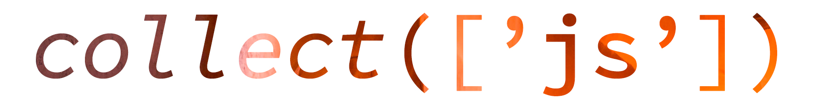

> 处理数组和对象的方便且无依赖性的包装类工具


[[Travis]](https://travis-ci.org/ecrmnn/collect.js/builds)
[[npm version]](http://badge.fury.io/js/collect.js)
[[npm downloads]](http://badge.fury.io/js/collect.js)
[[npm license]](http://badge.fury.io/js/collect.js)
[[PRs Welcome]](http://makeapullrequest.com)
[[dependencies]](https://github.com/ecrmnn/collect.js/blob/master/package.json)
[[eslint]](https://github.com/airbnb/javascript)

1 安装
===
```bash
npm install collect.js --save
```

2 提示
===
使用Laravel作为你的后台? Collect.js 提供一个和Laravel(几乎)一样的api[Laravel Collections](https://laravel.com/docs/5.5/collections) 5.5. [查看区别](#strictness-and-comparisons).


3 严格与比较
===
``collect.js``中的所有比较都是用严格的相等。在JavaScript中使用松散的相等比较通常是不令人满意的。默认laravel只执行“宽松的”比较并提供一些“严格”的比较方法。``collect.js``中这些方法还没有实现，因为所有的方法都是严格默认的。

#####  尚未实现的方法:
- ~~``containsStrict``~~ 采用 ``contains()``
- ~~``uniqueStrict``~~ 采用 ``unique()``
- ~~``whereStrict``~~ 采用 ``where()``
- ~~``whereInStrict``~~ 采用 ``whereIn()``
- ~~``whereNotInStrict``~~ 采用 ``whereNotIn()``

3.1 ``all()``
---
所有方法返回集合表示的底层数组：
```js
collect([1, 2, 3]).all();

//=> [1, 2, 3]
```

3.2 ``average()``
---
[``avg()``](#avg) 方法别名

3.3 ``avg()``
---
avg方法返回集合中所有对象的平均值：
```js
collect([1, 3, 3, 7]).avg();

//=> 3.5
```

如果集合包含嵌套数组或对象，则应传递一个键用于确定计算平均值的值：
```js
const collection = collect([{
  name: 'JavaScript: The Good Parts', pages: 176
}, {
  name: 'JavaScript: The Definitive Guide', pages: 1096
}]);

collection.avg('pages');

//=> 636
```

3.4 ``chunk()``
---
chunk方法将集合分解为给定大小的多个较小的集合：

```js
const collection = collect([1, 2, 3, 4, 5, 6, 7]);

const chunks = collection.chunk(4);

chunks.all();

//=> [[1, 2, 3, 4], [5, 6, 7]]
```
3.5 ``collapse()``
---
collapse方法将数组集合展开为成一个平面集合：
```js
const collection = collect([[1], [{}, 5, {}], ['xoxo']]);

const collapsed = collection.collapse();

collapsed.all();

//=> [1, {}, 5, {}, 'xoxo']
```

```js
const collection = collect([[1, 2, 3], [4, 5, 6], [7, 8, 9]]);

const collapsed = collection.collapse();

collapsed.all();

//=> [1, 2, 3, 4, 5, 6, 7, 8, 9]
```
3.6 ``combine()``
---
combine方法将集合的键与另一个数组或集合的值相结合：

```js
const collection = collect(['name', 'number']);

const combine = collection.combine(['Steven Gerrard', 8]);

combine.all();

//=> {
//=>   name: 'Steven Gerrard',
//=>   number: 8
//=> }
```

3.7 ``concat()``
---
Concat方法合并两个或两个以上的集合/数组对象：

*你也可以`concat()`对象数组或多维数组*

```js
const collection = collect([1, 2, 3]);

collection
  .concat(['a', 'b', 'c'])
  .concat({
    name: 'Steven Gerrard',
    number: 8
  });

collection.all();

//=> [1, 2, 3, 'a', 'b', 'c', 'Steven Gerrard', 8]
```

3.8 ``contains()``
---
contains方法确定集合是否包含给对象：

```js
const collection = collect({
  name: 'Steven Gerrard',
  number: 8
});

collection.contains('name');
//=> true

collection.contains('age');
//=> false
```

同样作用与数组
```js
const collection = collect([1, 2, 3]);

collection.contains(3);
//=> true
```

还可以将一个键/值对传递给contains方法，该方法将确定集合中是否存在给定的键值对：

```js
const collection = collect({
  name: 'Steven Gerrard',
  number: 8
});

collection.contains('name', 'Steve Jobs');
//=> false
```

还可以将回调传递给contains方法来执行自己的真实性测试：
```js
const collection = collect([1, 2, 3, 4, 5]);

collection.contains(function (value, key) {
  return value > 5;
});

//=> false
```

3.9 ``count()``
---
count方法返回集合中项目的总数：
```js
const collection = collect([1, 2, 3, 4]);

collection.count();

//=> 4
```

3.10 ``crossJoin()``
---
crossjoin方法交叉联接给定的数组或集合，返回的所有可能的排列集合：

```js
const collection = collect([1, 2]);

collection.crossJoin(['a', 'b']);

collection.all();

//=> [
//=>   [1, 'a'],
//=>   [1, 'b'],
//=>   [2, 'a'],
//=>   [2, 'b'],
//=> ]
```

3.11 ``dd()``
---
dd方法对集合执行console.log方法并退出当前的进程：

```js
const collection = collect([1, 2, 3]).dd();

//=> [1, 2, 3]
//=> (Exits node.js process)
```

3.12 ``diff()``
---
diff方法根据其值将集合与另一个集合或普通数组进行比较。此方法将返回原始集合中不存在于给定集合中的值：

```js
const collection = collect([1, 2, 3, 4, 5]);

const diff = collection.diff([1, 2, 3, 9]);

diff.all();

//=> [4, 5]
```

3.13 ``diffAssoc()``
---
diffassoc方法基于key和value来比较集合和简单对象。
此方法将返回原始集合中不存在于给定集合中的键/值对：


```js
const collection = collect({
  color: 'orange',
  type: 'fruit',
  remain: 6,
});

const diff = collection.diffAssoc({
  color: 'yellow',
  type: 'fruit',
  remain: 3,
  used: 6,
});

diff.all();

//=> { color: 'orange', remain: 6 };
```

3.14 ``diffKeys()``
---
diffkeys方法基于key比较集合或者普通对象。此方法将返回原始集合中不存在于给定集合中的键/值对：

```js
const collection = collect({
  a: 'a',
  b: 'b',
  c: 'c',
  d: 'd'
});

const diff = collection.diffKeys({
  b: 'b',
  d: 'd'
});

diff.all();

//=> {a: 'a', c: 'c'}
```

3.15 ``dump()``
---
dump方法在此时输出结果，然后继续执行：

```js
collect([1, 2, 3, 4])
  .dump()
  .map(item => item * 2)
  .dump();

//=> [1, 2, 3, 4]
//=> [2, 4, 6, 8]
```

3.16 ``each()``
---
each方法通过回调方法遍历集合中的对象：

```js
let sum = 0;

const collection = collect([1, 3, 3, 7]);

collection.each(function (item) {
  sum += item;
});

//=> console.log(sum);
//=> 14
```

如果想停止遍历项目，需要从回调中返回false：

```js
let sum = 0;

const collection = collect([1, 3, 3, 7]);

collection.each(function (item) {
  if (item > 3) {
    return false;
  }

  sum += item;
});

//=> console.log(sum);
//=> 7
```

3.17 ``eachSpread()``
---
eachspread方法遍历集合的对象，通过各嵌套项目的值作为参数传入回调函数：

```js
const collection = collect([['John Doe', 35], ['Jane Doe', 33]]);

collection.eachSpread((name, age) => {
    //
});
```

可以通过从回调返回false来停止遍历项目：

```js
collection.eachSpread((name, age) => {
    return false;
});
```

3.18 ``every()``
---

every方法可以用来验证集合的所有元素的真值检验：

```js
collect([1, 2, 3, 4]).every(function (value, key) {
  return value > 2;
});

//=> false
```

3.19 ``except()``
---
except方法返回集合中除了指定键的那些外的所有项：


```js
const collection = collect({
  product_id: 1,
  price: 100,
  discount: false,
});

const filtered = collection.except(['price', 'discount']);

filtered.all();

//=> {product_id: 1}
```

```js
collect([1, 2, 3, 4]).except([2, 12]).all();

//=> [1, 3, 4]
```

> `except`方法的相反的操作，参见`only`方法。

3.20 ``filter()``
---
filter方法使用给定的回调来过滤集合，只保留返回值为true的对象：

```js
const collection = collect([1, 2, 3, 4]);

const filtered = collection.filter(function (value, key) {
    return value > 2;
});

filtered.all();

//=> [3, 4]
```

如果不提供回调，则所有与`false`等效的集合的条目将被删除：


```js
const collection = collect([0, 1, 2, null, 3, 4, undefined, 5, 6, 7, [], 8, 9, {}, 10]);

const filtered = collection.filter();

filtered.all();

//=> [1, 2, 3, 4, 5, 6, 7, 8, 9, 10]
```

> `filter`方法的相反的操作，参见`reject`方法。

3.21 ``first()``
---
first方法返回集合中传递回调方法中返回true的第一个元素：

```js
collect([1, 2, 3, 4]).first(function (item) {
  return item > 1;
});

//=> 2
```

还可以不传参数调用first方法，来获取集合中的第一个元素。如果集合为空，则返回null：

```js
collect([1, 2, 3, 4]).first();

//=> 1
```

3.22 ``firstWhere()``
---
firstwhere方法返回集合中与给定的键/值对(key/value)匹配的第一个元素：


```js
const collection = collect([
    {name: 'Regena', age: 12},
    {name: 'Linda', age: 14},
    {name: 'Diego', age: 23},
    {name: 'Linda', age: 84},
]);

collection.firstWhere('name', 'Linda');

//=> { name: 'Linda', age: 14 }
```

3.23 ``flatMap()``
---
flatmap方法通过回调函数遍历集合。回调可以自由地修改项目并返回它，从而形成一个新的集合。然后，数组被降低一个维度.

```js
const collection = collect([
 { name: 'Robbie Fowler' },
 { nickname: 'The God' },
 { position: 'Striker' },
]);

const flatMapped = collection.flatMap(values => values.map(value => value.toUpperCase()));

flatMapped.all();

//=> {
//=>   name: 'ROBBIE FOWLER',
//=>   nickname: 'THE GOD',
//=>   position: 'STRIKER'
//=> }
```

3.24 ``flatten()``
---
flatten方法把一个多维集合成一个单一的维度：

```js
const collection = collect({
  club: 'Liverpool',
  players: ['Sturridge', 'Firmino', 'Coutinho']
});

const flattened = collection.flatten();

flattened.all();

//=> ['Liverpool', 'Sturridge', 'Firmino', 'Coutinho'];
```
可以随意地传递函数一个“深度”参数：
```js
const collection = collect({
  Apple: [{
    name: 'iPhone 6S',
    brand: 'Apple'
  }],
  Samsung: [{
    name: 'Galaxy S7',
    brand: 'Samsung'
  }]
});

const flattened = collection.flatten(1);

flattened.all();

//=> [
//=>   {name: 'iPhone 6S', brand: 'Apple'},
//=>   {name: 'Galaxy S7', brand: 'Samsung'}
//=> ]
```

在这个例子中，调用不提供深度也会变为一维的嵌套数组，生成` ` [ 'iphone 6s '，'Apple'，'Galaxy S7 '，'Samsung' ` ` ]。提供深度可以限制将扁平化的嵌套数组的层级。


3.25 ``flip()``
---
flip方法将集合的键与相应的值交换：

```js
const collection = collect({
  name: 'Steven Gerrard',
  number: 8
});

const flipped = collection.flip();

flipped.all();

//=> {
//=>   'Steven Gerrard': 'name',
//=>   '8': 'number'
//=> }
```

3.26 ``forget()``
---
forget方法通过其键从集合中移除项：

```js
const collection = collect({
  name: 'Steven Gerrard',
  number: 8
});

collection.forget('number');

collection.all();

//=> {
//=>   name: 'Steven Gerrard'
//=> }
```

> 与大多数其他集合方法不同，forget不返回一个新的修改后的集合；它修改调用的集合。

3.27 ``forPage()``
---

forpage方法返回一个新的集合中的指定页码包含的对象。该方法接受页码作为第一个参数，每页显示的项目数作为第二个参数：


```js
const collection = collect([1, 2, 3, 4, 5, 6, 7, 8, 9]);

const forPage = collection.forPage(2, 3);

forPage.all();

//=> [4, 5, 6]
```

3.28 ``get()``
---
get方法返回key对应的值。如果key不存在，则返回“null”：


```js
const collection = collect({
  firstname: 'Chuck',
  lastname: 'Norris'
});

collection.get('lastname');

//=> Norris

collection.get('middlename');
//=> null
```

可以将默认值作为第二个参数传递：

```js
const collection = collect({
  firstname: 'Chuck',
  lastname: 'Norris'
});

collection.get('middlename', 'default-value');
//=> default-value
```

甚至可以将回调作为默认值传递。如果指定的键不存在，回调的结果将返回：

```js
const collection = collect({
  firstname: 'Chuck',
  lastname: 'Norris'
});

collection.get('middlename', function () {
  return 'default-value';
});

//=> default-value
```
3.29 ``groupBy()``
---
GroupBy方法用一个指定key组合一个集合中的对象：


```js
const collection = collect([
  {
    product: 'Chair',
    manufacturer: 'IKEA'
  },
  {
    product: 'Desk',
    manufacturer: 'IKEA'
  },
  {
    product: 'Chair',
    manufacturer: 'Herman Miller'
  }
]);

const grouped = collection.groupBy('manufacturer');

grouped.all();

//=> {
//=>   IKEA: [
//=>     {
//=>       id: 100,
//=>       product: 'Chair',
//=>       manufacturer: 'IKEA',
//=>       price: '1490 NOK'
//=>     },
//=>     {
//=>       id: 150,
//=>       product: 'Desk',
//=>       manufacturer: 'IKEA',
//=>       price: '900 NOK'
//=>     }
//=>   ],
//=>   'Herman Miller': [
//=>     {
//=>       id: 200,
//=>       product: 'Chair',
//=>       manufacturer: 'Herman Miller',
//=>       price: '9990 NOK'
//=>     }
//=>   ]
//=> }
```
除了传递字符串键之外，还可以传递回调函数。回调函数应该返回希望组合的值：

```js
const collection = collect([
  {
    product: 'Chair',
    manufacturer: 'IKEA'
  },
  {
    product: 'Desk',
    manufacturer: 'IKEA'
  },
  {
    product: 'Chair',
    manufacturer: 'Herman Miller'
  }
]);

const grouped = collection.groupBy(function (item, key) {
  return item.manufacturer.substring(0, 3);
});

grouped.all();

//=> {
//=>   IKE: [
//=>     {
//=>       id: 100,
//=>       product: 'Chair',
//=>       manufacturer: 'IKEA',
//=>       price: '1490 NOK'
//=>     },
//=>     {
//=>       id: 150,
//=>       product: 'Desk',
//=>       manufacturer: 'IKEA',
//=>       price: '900 NOK'
//=>     }
//=>   ],
//=>   Her: [
//=>     {
//=>       id: 200,
//=>       product: 'Chair',
//=>       manufacturer: 'Herman Miller',
//=>       price: '9990 NOK'
//=>     }
//=>   ]
//=> }
```

3.30 ``has()``
---
has方法判断集合中是否存在一个或多个键：


```js
const collection = collect({
  animal: 'unicorn',
  ability: 'magical'
});

collection.has('ability');

//=> true

collection.has(['animal', 'ability']);

//=> true

collection.has(['animal', 'ability', 'name']);

//=> false
```

3.31 ``implode()``
---
implode方法连接集合中对象。它的参数取决于集合中的项类型。如果集合包含数组或对象，则应传递希望加入的属性的key和value之间的“胶水”字符串：

```js
const collection = collect([{
    product: 'Chair',
    manufacturer: 'IKEA',
  }, {
    product: 'Desk',
    manufacturer: 'IKEA',
  }, {
    product: 'Chair',
    manufacturer: 'Herman Miller',
  }]);

collection.implode('product', ',');

//=> Chair, Desk, Chair
```
如果集合包含简单的字符串或数字，只传递“胶水”参数：

```js
collect([1, 2, 3, 4, 5]).implode('-');

//=> 1-2-3-4-5
```

3.32 ``intersect()``
---
intersect方法从集合删除给定的数组或者集合中不存在的值。生成的集合将保存原始集合的key：

```js
const collection = collect([1, 2, 3, 4, 5]);

intersect = collection.intersect([1, 2, 3, 9]);

intersect.all();

//=> [1, 2, 3]
```

3.33 ``intersectByKeys()``
---
intersectbykeys方法从原来的集合中删除不在给定的数组或集合中的key值：

```js
const collection = collect({
    serial: 'UX301',
    type: 'screen',
    year: 2009,
});

const intersect = collection.intersectByKeys({
  reference: 'UX404',
  type: 'tab',
  year: 2011,
});

intersect.all();

// ['type' => 'screen', 'year' => 2009]
```

```js
const firstCollection = collect([1, 2, 3, 4, 5]);
const secondCollection = collect([1, 2, 3, 9]);

intersect = firstCollection.intersect(secondCollection);

intersect.all();

//=> [1, 2, 3]
```

3.34 ``isEmpty()``
---
isEmpty方法,如果集合是空的返回true；否则，返回false：


```js
collect([]).isEmpty();

//=>  true
```

3.35 ``isNotEmpty()``
---
The isNotEmpty method returns true if the collection is not empty; otherwise, false is returned:
```js
collect([1, 2, 3]).isNotEmpty();

//=>  true
```

3.36 ``keyBy()``
---
keyby方法由给定的key值给集合过滤。如果多个项具有相同的键，则只有最后一个项将出现在新集合中：

```js
const collection = collect([
  {
    product: 'Chair',
    manufacturer: 'IKEA'
  }, {
    product: 'Desk',
    manufacturer: 'IKEA'
  }, {
    product: 'Chair',
    manufacturer: 'Herman Miller'
  }
]);

const keyed = collection.keyBy('manufacturer');

keyed.all();

//=> {
//=>   IKEA: {
//=>     product: 'Desk',
//=>     manufacturer: 'IKEA'
//=>   },
//=>   'Herman Miller': {
//=>     product: 'Chair',
//=>     manufacturer: 'Herman Miller'
//=>   }
//=> }
```

还可以将回调传递给方法。回调函数应该返回集合中key对应的值:


```js
const keyedUpperCase = collection.keyBy(function (item) {
  return item['manufacturer'].toUpperCase();
});

keyedUpperCase.all();

//=> {
//=>   IKEA: {
//=>     product: 'Desk',
//=>     manufacturer: 'IKEA'
//=>   },
//=>   'HERMAN MILLER': {
//=>     product: 'Chair',
//=>     manufacturer: 'Herman Miller'
//=>   }
//=> }
```

3.37 ``keys()``
---
keys方法返回集合的所有key：


```js
const collection = collect([{
  name: 'Steven Gerrard',
  number: 8
}, {
  club: 'Liverpool',
  nickname: 'The Reds'
}]);

keys = collection.keys();

//=> ['name', 'number', 'club', 'nickname']
```

3.38 ``last()``
---
last方法返回,集合中的最后一个回调方法返回true的元素：

```js
const collection = collect([1, 2, 3]);

const last = collection.last(function (item) {
  return item > 1;
});

//=> 3
```
还可以调用没有参数的last方法来获取集合中的最后一个元素。如果集合为空，则返回null：
```js
collect([1, 2, 3, 4]).last();

//=> 4
```

3.39 ``macro()``
---
macro方法允许您注册自定义方法。
```js
collect().macro('uppercase', function () {
  return this.map(function (item) {
    return item.toUpperCase();
  });
});

const collection = collect(['a', 'b', 'c']);

collection.uppercase();

collection.all();

//=> ['A', 'B', 'C']
```

> 注意`macro`方法返回`undefined`，因此不可能在有先后关系的方法中使用它。


3.40 ``map()``
---

map方法经过每一个值的回调函数遍历集合。回调可以自由地修改项目并返回它，从而形成一个新的修改项目集合：


```js
const collection = collect([1, 2, 3, 4, 5]);

const multiplied = collection.map(function (item) {
  return item * 2;
});

multiplied.all();

//=> [2, 4, 6, 8, 10]
```

> 像大多数其他集合方法一样，``map``返回一个新的集合实例；它不修改调用的集合。如果要转换原始集合，请使用``transform``方法。

3.41 ``mapInto()``
---

mapinto方法遍历集合,每个元素作为一个构造函数实例化给定类：


```js
const Player = function (name) {
  this.name = name;
};

const collection = collect([
  'Roberto Firmino',
  'Sadio Mané',
]);

const players = collection.mapInto(Player);

players.all();

//=> [
//=>   Player { name: 'Roberto Firmino' },
//=>   Player { name: 'Sadio Mané' },
//=> ]
```

3.42 ``mapSpread()``
---

mapspread方法通过各嵌套项目value为回调函数参数遍历集合的项目。
回调可以自由地修改项目并返回它，从而形成一个新的目集合：

```js
const collection = collect([0, 1, 2, 3, 4, 5, 6, 7, 8, 9]);

const chunks = collection.chunk(2);

const sequence = chunks.mapSpread((odd, even) => {
    return odd + even;
});

sequence.all();

//=> [1, 5, 9, 13, 17]
```

3.43 ``mapToDictionary()``
---
将对象进行dictionary映射。
回调应该返回一个带有一个key/value对的关联数组。

```js
const collection = collect([
  { id: 1, name: 'a' },
  { id: 2, name: 'b' },
  { id: 3, name: 'c' },
  { id: 4, name: 'b' },
]);

const groups = collection.mapToDictionary(item => [item.name, item.id]);

groups.all();

//=> {
//=>   a: [1],
//=>   b: [2, 4],
//=>   c: [3],
//=> }
```

3.44 ``mapToGroups()``
---
maptogroups方法将每一个元素的value作为参数传入回调函数遍历集合：

```js
const collection = collect([
  { id: 1, name: 'A' },
  { id: 2, name: 'B' },
  { id: 3, name: 'C' },
  { id: 4, name: 'B' },
]);

const groups = collection.mapToGroups(function (item, key) {
  return [item.name, item.id];
});

//=> {
//=>   A: [1],
//=>   B: [2, 4],
//=>   C: [3],
//=> }
```

3.45 ``mapWithKeys()``
---
mapwithkeys方法遍历集合，将每一个元素的值传入回调函数。回调应该返回一个数组，其中第一个元素代表键，第二个元素表示值对：

```js
const collection = collect([{
    'name': 'John',
    'department': 'Sales',
    'email': 'john@example.com'
  }, {
    'name': 'Jane',
    'department': 'Marketing',
    'email': 'jane@example.com'
  }]);

const keyed = collection.mapWithKeys(function (item) {
  return [item.email, item.name];
});

keyed.all();

//=> {
//=>   'john@example.com': 'John',
//=>   'jane@example.com': 'Jane',
//=> }
```

3.46 ``max()``
---
max方法返回给定key的最大值：

```js
const collection = collect([{
  value: 10
}, {
  value: -13
}, {
  value: 12
}, {
  unicorn: false
}]);

const max = collection.max('value');

//=> 12
```
```js
collect([-1, -2345, 12, 11, 3]).max();

//=> 12
```

3.47 ``median()``
---
median方法返回给定key的中值：


```js
collect([1, 3, 3, 6, 7, 8, 9]).median();

//=> 6
```

```js
collect([{
  foo: 1
}, {
  foo: 1
}, {
  foo: 2
}, {
  foo: 4
}]).median('foo');

//=> 1.5
```

3.48 ``merge()``
---

merge方法将给定对象合并到原始集合中。如果给定对象中的键与原始集合中的键匹配，则给定对象值将覆盖原始集合中的值：

```js
const collection = collect({
  id: 1,
  price: 29
});

const merged = collection.merge({
  price: 400,
  discount: false
});

merged.all();

//=> {id: 1, price: 400, discount: false}
```

如果我们的集合是一个数组，那么值将被附加到集合的结尾：

```js
const collection = collect(['Unicorn', 'Rainbow']);

const merged = collection.merge(['Sunshine', 'Rainbow']);

merged.all();

//=> ['Unicorn', 'Rainbow', 'Sunshine', 'Rainbow']
```

3.49 ``min()``
---
min方法返回给定key的最小值：

```js
const collection = collect[{
  worth: 100
}, {
  worth: 900
}, {
  worth: 79
}]);

collection.min('worth');

//=> 79
```
```js
collect([1, 2, 3, 4, 5]).min();

//=> 1
```

3.50 ``mode()``
---
mode方法返回给定key的众数值：

```js
collect([1, 3, 3, 6, 7, 8, 9]).mode();

//=> [3]
```

```js
collect([{
  foo: 1
}, {
  foo: 1
}, {
  foo: 2
}, {
  foo: 4
}]).mode('foo');

//=> [1]
```

3.51 ``nth()``
---
nth方法创建一个新的集合，由每一个位置可以被n整除的元素组成：

```js
const collection = collect(['a', 'b', 'c', 'd', 'e', 'f']);

const nth = collection.nth(4);

nth.all();

//=> ['a', 'e']
```

3.52 ``only()``
---
only方法返回集合中对象中指定key值的数据：

```js
const collection = collect({
  id: 12,
  name: 'John Doe',
  email: 'john@doe.com',
  active: true,
});

const filtered = collection.only(['name', 'email']);

filtered.all();

//=> {name: 'John Doe', email: 'john@doe.com'}
```

```js
collect([1, 2, 3, 4]).only([2, 12]).all();

//=> [2]
```

> `only`方法的相反的操作，参见`except`方法。


3.53 ``pad()``
---
pad方法将用给定值填充数组，直到数组达到指定的大小为止。
此方法的行为类似于[array_pad](https://secure.php.net/manual/en/function.array-pad.php) PHP 方法.
若要向左填充，应指定负大小。如果给定大小的绝对值小于或等于数组的长度，则不会发生填充：


```js
const collection = collect(['A', 'B', 'C']);

let filtered = collection.pad(5, 0);

filtered.all();

//=> ['A', 'B', 'C', 0, 0]

filtered = collection.pad(-5, 0);

filtered.all();

//=> [0, 0, 'A', 'B', 'C']
```

3.54 ``partition()``
---
partition方法可以通过特定条件分离集合：


```js
const collection = collect([1, 2, 3, 4, 5, 6]);

const [underThree, overThree] = collection.partition(function (i) {
  return i < 3;
});
```

3.55 ``pipe()``
---
pipe方法将集合传递给给定的回调函数并返回结果：

```js
const collection = collect([1, 2, 3]);

const piped = collection.pipe(function (collection) {
  return collection.sum();
});

//=> 6
```

3.56 ``pluck()``
---
pluck方法检索给定键的所有值：

```js
const collection = collect([{
  id: 78,
  name: 'Aeron'
}, {
  id: 79,
  name: 'Embody'
}]);

const plucked = collection.pluck('name');

plucked.all();

//=> ['Aeron', 'Embody']
```

还可以指定希望如何将结果集合通过key进行索引：


```js
const collection = collect([{
  id: 78,
  name: 'Aeron'
}, {
  id: 79,
  name: 'Embody'
}]);

const plucked = collection.pluck('name', 'id');

plucked.all();

//=> {
//=>   78: 'Aeron',
//=>   79: 'Embody'
//=> }
```

3.57 ``pop()``
---
pop方法将从集合中删除并返回最后一项：

```js
const collection = collect([1, 2, 3, 4, 5]);

collection.pop();

//=> 5

collection.all();

// => [1, 2, 3, 4]
```

3.58 ``prepend()``
---
prepend方法在将元素添加到集合的开头：

```js
const collection = collect([1, 2, 3, 4, 5]);

collection.prepend(0);

collection.all();

//=> [0, 1, 2, 3, 4, 5]
```


也可以通过第二个参数设置的key值：


> 小贴士：在JavaScript中对象属性的顺序是不一定的; 用key调用prependf方法时，集合使用底层的``put``。只有通过这样，collect.js才能有和laravel相同API。
```js
const collection = collect({
  product: 'iPhone 6s'
});

collection.prepend('Apple', 'brand');

collection.all():

//=> {
//=>   brand: 'Apple',
//=>   product: 'iPhone 6s'
//=> }
```

3.59 ``pull()``
---
pull法通过键移除并从集合返回一个项：

```js
const collection = collect({
  firstname: 'Michael',
  lastname: 'Cera'
});

collection.pull('lastname');

//=> Cera

collection.all();

//=> {firstname: 'Michael'}
```

3.60 ``push()``
---
push方法附加一个项目到集合的末尾：

```js
const collection = collect([1, 2, 3, 4]);

collection.push(5);

collection.all();

//=> [1, 2, 3, 4, 5]
```

3.61 ``put()``
---
put方法在集合中设置给定的键和值：

```js
const collection = collect(['JavaScript', 'Python']);

collection.put('Ruby');

collection.all();

//=> ['JavaScript', 'Python', 'Ruby']
```

3.62 ``random()``
---
random方法从集合中返回一个随机项：

```js
const collection = collect([1, 2, 3, 4, 5]);

collection.random();

//=> 4 (retrieved randomly)
```

可以随意将一个整数传递给random方法，以指定要随机检索多少项。如果该整数大于1，则返回一个项目集合：


```js
const random = collection.random(3);

//=> [5, 3, 4] (retrieved randomly)
```

3.63 ``reduce()``
---
reduce方法将集合减少到单个值，将每个迭代的结果传递到后续迭代中：

```js
const collection = collect([1, 2, 3]);

const total = collection.reduce(function (carry, item) {
  return carry + item;
});

//=> 6
```

在第一次迭代中，``carry``的值是null；但是，您可以通过传递第二个参数来指定它的初始值：

```js
const total = collection.reduce(function (carry, item) {
  return carry + item;
}, 4);

//=> 10
```

3.64 ``reject()``
---
reject方法使用给定回调函数过滤集合。如果从结果集合中删除该项，则回调应该返回true：

```js
const collection = collect([1, 2, 3, 4]);

const filtered = collection.reject(function (value) {
  return value > 2;
});

//=> [1, 2]
```

> `reject`方法的相反的操作，参见`filter`方法。

3.65 ``reverse()``
---

reverse方法反转集合项的顺序：

```js
const collection = collect([1, 2, 3, 4, 5]);

const reversed = collection.reverse();

reversed.all();

//=> [5, 4, 3, 2, 1]
```

3.66 ``search()``
---

search方法搜索集合中给定的值，如果找到的话返回它的key。如果未找到该项，则返回false。


```js
const collection = collect([2, 4, 6, 8]);

collection.search(4);

//=> 1
```
search是通过“松散”比较来完成的，这意味着一个整数值的字符串将被认为等于一个相同值的整数。若要使用严格的比较，请将true作为方法的第二个参数：

```js
collection.search('4', true);

//=> false
```

或者，可以通过自己的回调来搜索返回true的第一个项目：


```js
collection.search(function (item, key) {
  return item > 5;
});

//=> 2
```

3.67 ``shift()``
---
shift方法从集合中移除并返回第一项：


```js
const collection = collect([1, 2, 3, 4, 5]);

collection.shift();

//=> 1

collection.all();

//=> [2, 3, 4, 5]
```

3.68 ``shuffle()``
---
shuffle将集合中的项随机排序：


```js
const collection = collect([1, 2, 3, 4, 5]);

const shuffled = collection.shuffle();

shuffled.all();

//=> [3, 5, 1, 2, 4] (generated randomly)
```

3.69 ``slice()``
---
slice方法从给定索引开始返回集合的一部分：


```js
const collection = collect([1, 2, 3, 4, 5, 6, 7, 8, 9, 10]);

const slice = collection.slice(4);

slice.all();

//=> [5, 6, 7, 8, 9, 10]
```

如果想限制返回的片的大小，请将所需的大小作为第二个参数传递给方法：


```js
const slice = collection.slice(4, 2);

slice.all();

//=> [5, 6]
```

3.70 ``sort()``
---
sort方法对集合进行排序：

```js
const collection = collect([5, 3, 1, 2, 4]);

const sorted = collection.sort();

sorted.all();

//=> [1, 2, 3, 4, 5]
```

> 如果您排序需要更高级，可以通过回调来用自己的算法进行排序。


```js
const collection = collect([5, 3, 1, 2, 4]);

const sorted = collection.sort(function (a, b) {
  return b - a;
});

sorted.all();

//=> [5, 4, 3, 2, 1]
```

> 如果需要排序嵌套数组或对象，参考``sortBy`` 和`sortByDesc``方法。


3.71 ``sortBy()``
---
sortBy方法排序由给定的键key的集合。排序的集合保留原来的数组键，因此在本例中，我们将使用值方法将key重置为连续编号索引：

```js
const collection = collect([
  {name: 'Desk', price: 200},
  {name: 'Chair', price: 100},
  {name: 'Bookcase', price: 150},
]);

const sorted = collection.sortBy('price');

sorted.all();

//=> [
//=>   {name: 'Chair', price: 100},
//=>   {name: 'Bookcase', price: 150},
//=>   {name: 'Desk', price: 200},
//=> ]
```

还可以通过自己的回调来确定如何对集合值进行排序：

```js
const collection = collect([
  {name: 'Desk', colors: ['Black', 'Mahogany']},
  {name: 'Chair', colors: ['Black']},
  {name: 'Bookcase', colors: ['Red', 'Beige', 'Brown']},
]);

const sorted = collection.sortBy(function (product, key) {
  return product['colors'].length;
});

sorted.all();

//=> [
//=>   {name: 'Chair', colors: ['Black']},
//=>   {name: 'Desk', colors: ['Black', 'Mahogany']},
//=>   {name: 'Bookcase', colors: ['Red', 'Beige', 'Brown']},
//=> ]
```

3.72 ``sortByDesc()``
---
sortByDesc方法具有相同的签名的``sortBy``方法，但以相反的顺序排序。


3.73 ``splice()``
---
splice方法从指定索引处移除一个元素并返回修改后的数组：


```js
const collection = collect([1, 2, 3, 4, 5]);

const chunk = collection.splice(2);

chunk.all();

//=> [3, 4, 5]

collection.all();

//=> [1, 2]
```

可以传递第二个参数来限制结果块的大小：


```js
const collection = collect([1, 2, 3, 4, 5]);

const chunk = collection.splice(2, 1);

chunk.all();

//=> [3]

collection.all();

//=> [1, 2, 4, 5]
```

3.74 ``split()``
---
split方法将集合分解为给定的组数：

```js
const collection = collect([1, 2, 3, 4, 5]);

const groups = collection.split(3);

//=> [[1, 2], [3, 4], [5]]
```

此外，还可以传递的第三参数作为新的元素，以替换从集合中移除的项：


```js
const collection = collect([1, 2, 3, 4, 5]);

const chunk = collection.splice(2, 1, [10, 11]);

chunk.all()

//=> [3]

collection.all();

//=> [1, 2, 10, 11, 4, 5]
```

3.75 ``sum()``
---
sum方法返回集合中所有项的和：

```js
collect([1, 2, 3]).sum();

//=> 6
```

如果集合包含嵌套数组或对象，则应传递一个键用于确定要相加的值：


```js
const collection = collect([
  {name: 'JavaScript: The Good Parts', pages: 176},
  {name: 'JavaScript: The Definitive Guide', pages: 1096},
]);

collection.sum('pages');

//=> 1272
```
此外，还可以通过自己的回调来返回需要相加的值：

```js
const collection = collect([
  {name: 'Desk', colors: ['Black', 'Mahogany']},
  {name: 'Chair', colors: ['Black']},
  {name: 'Bookcase', colors: ['Red', 'Beige', 'Brown']},
]);

const total = collection.sum(function (product) {
  return product.colors.length;
});

//=> 6
```

3.76 ``take()``
---
take方法返回一个具有指定项目数的新集合：
还可以传递一个负整数，从集合的结尾取指定数量的元素：


```js
const collection = collect([0, 1, 2, 3, 4, 5]);

const chunk = collection.take(3);

chunk.all();

//=> [0, 1, 2]
```

3.77 ``tap()``
---
tap方法将集合传递给给定的回调函数，允许您在特定的点“点击”到集合中，并在不影响集合本身的情况下对元素做一些事情：


```js
const collect([2, 4, 3, 1, 5])
  .sort()
  .tap(function (collection) {
    console.log(collection.all());

    //=> [1, 2, 3, 4, 5]
  })
  .shift();

//=> 1
```

3.78 ``times()``
---
times方法通过调用给定次数的回调创建一个新集合：

```js
const collection = collect().times(10, function (number) {
  return number * 9;
});

collection.all();

//=> [9, 18, 27, 36, 45, 54, 63, 72, 81, 90]
```

3.79 ``toArray()``
---
toArray方法将收集到一个数组。
如果集合是一个对象，则返回一个包含值的数组。


```js
const collection = collect([1, 2, 3, 'b', 'c']);

collection.toArray();

//=> [1, 2, 3, 'b', 'c']
```

```js
const collection = collect({
  name: 'Elon Musk',
  companies: [
    'Tesla',
    'Space X',
    'SolarCity'
  ]
});

collection.toArray();

//=> ['Elon Musk', ['Tesla', 'Space X', 'SolarCity']]
```

3.80 ``toJson()``
---
toJson方法将集合转化为JSON字符串：


```js
const collection = collect({
  id: 384,
  name: 'Rayquaza',
  gender: 'NA'
});

const json = collection.toJson();

//=> {"id": 384, "name": "Rayquaza", "gender": "NA"}
```

3.81 ``transform()``
---
transform方法遍历集合并通回调调用给定集合中的每个元素。集合中元素目将由回调返回的值替换：


```js
const collection = collect([1, 2, 3, 4, 5]);

collection.transform(function (item, key) {
  return item * 2;
});

collection.all();

//=> [2, 4, 6, 8, 10]
```

> 与大多数其他集合方法不同，``transform``修改集合本身。如果您希望创建一个新的集合，请使用``map``方法。

3.82 ``union()``
---
union方法将给定数组添加到集合中。如果给定数组包含已经存在于原始集合中的key，则首选原始集合的value：

```js
const collection = collect({
  a: 'A',
  b: 'B'
});

const union = collection.union({
  a: 'AAA',
  c: 'CCC',
  b: 'BBB'
});

union.all();

//=> {
//=>   a: 'A',
//=>   b: 'B',
//=>   c: 'CCC'
//=> }
```

3.83 ``unique()``
---
unique方法给集合去重并返回：


```js
const collection = collect([1, 1, 1, 2, 3, 3]);

const unique = collection.unique();

unique.all();

//=> [1, 2, 3]
```

在处理一组对象时，可以指定用于确定唯一性的键：


```js
const collection = collect([
  {name: 'iPhone 6', brand: 'Apple', type: 'phone'},
  {name: 'iPhone 5', brand: 'Apple', type: 'phone'},
  {name: 'Apple Watch', brand: 'Apple', type: 'watch'},
  {name: 'Galaxy S6', brand: 'Samsung', type: 'phone'},
  {name: 'Galaxy Gear', brand: 'Samsung', type: 'watch'}
]);

const unique = collection.unique('brand');

unique.all();

//=> [
//=>   {name: 'iPhone 6', brand: 'Apple', type: 'phone'},
//=>   {name: 'Galaxy S6', brand: 'Samsung', type: 'phone'},
//=> ]
```

还可以通过自己的回调来确定项目的唯一性：

```js
const collection = collect([
  {name: 'iPhone 6', brand: 'Apple', type: 'phone'},
  {name: 'iPhone 5', brand: 'Apple', type: 'phone'},
  {name: 'Apple Watch', brand: 'Apple', type: 'watch'},
  {name: 'Galaxy S6', brand: 'Samsung', type: 'phone'},
  {name: 'Galaxy Gear', brand: 'Samsung', type: 'watch'}
]);

const unique = collection.unique(function (item) {
  return item.brand + item.type;
});

unique.all();

//=> [
//=>   {name: 'iPhone 6', brand: 'Apple', type: 'phone'},
//=>   {name: 'Apple Watch', brand: 'Apple', type: 'watch'},
//=>   {name: 'Galaxy S6', brand: 'Samsung', type: 'phone'},
//=>   {name: 'Galaxy Gear', brand: 'Samsung', type: 'watch'},
//=> ]
```

3.84 ``unless()``
---
当方法的第一个参数计算为false时，unless方法将执行给定的回调函数：

```js
const collection = collect([1, 2, 3]);

collection.unless(false, function (collection) {
  return collection.push(4);
});

collection.all();

//=> [1, 2, 3, 4]
```

3.85 ``unwrap()``
---
unwrap方法将展开给定集合：


```js
const collection = collect([1, 2, 3]);

collect().unwrap(collection);

//=> [1, 2, 3]
```

3.86 ``values()``
---
values方法返回一个新的集合，key重置为连续整数：

```js
const collection = collect({a: 'xoxo', b: 'abab', 'c': '1337', 1337: 12});

const values = collection.values();

values.all();

//=> [12, 'xoxo', 'abab', '1337']
```

3.89 ``when()``
---
当方法的第一个参数计算为true时，when方法将执行给定的回调函数：

```js
const collection = collect([1, 2, 3]);

collection.when(true, function (collection) {
  return collection.push(4);
});

collection.all();

//=> [1, 2, 3, 4]
```

3.90 ``where()``
---
where方法通过给定的键/值对过滤集合：

```js
const collection = collect([
  {product: 'Desk', price: 200},
  {product: 'Chair', price: 100},
  {product: 'Bookcase', price: 150},
  {product: 'Door', price: 100},
]);

const filtered = collection.where('price', 100);

filtered.all();

//=> [
//=>   {product: 'Chair', price: 100},
//=>   {product: 'Door', price: 100}
//=> ]
```

where方法还允许进行自定义比较：

**非同一性 / 严格不等式 ``(!==)``**
```js
const filtered = collection.where('price', '!==', 100);

filtered.all();

//=> [
//=>   {product: 'Desk', price: 200},
//=>   {product: 'Bookcase', price: 150}
//=> ]
```
**小于操作符 ``(<)``**
```js
const filtered = collection.where('price', '<', 100);

filtered.all();

//=> []
```
**小于或等于运算符 ``(<=)``**
```js
const filtered = collection.where('price', '<=', 100);

filtered.all();

//=> [
//=>   {product: 'Chair', price: 100},
//=>   {product: 'Door', price: 100}
//=> ]
```

**大于运算符 ``(>)``**
```js
const filtered = collection.where('price', '>', 100);

filtered.all();

//=> [
//=>   {product: 'Desk', price: 200},
//=>   {product: 'Bookcase', price: 150}
//=> ]
```
**大于或等于运算符 ``(>=)``**
```js
const filtered = collection.where('price', '>=', 150);

filtered.all();

//=> [
//=>   {product: 'Desk', price: 200},
//=>   {product: 'Bookcase', price: 150}
//=> ]
```

3.91 ``whereIn()``
---
whereIn方法通过给定数组中包含的给定键/值筛选集合。

```js
const collection = collect([
  {product: 'Desk', price: 200},
  {product: 'Chair', price: 100},
  {product: 'Bookcase', price: 150},
  {product: 'Door', price: 100},
]);

const filtered = collection.whereIn('price', [100, 150]);

filtered.all();

//=> [
//=>   {product: 'Chair', price: 100},
//=>   {product: 'Bookcase', price: 150},
//=>   {product: 'Door', price: 100},
//=> ]
```

3.92 ``whereNotIn()``
---
whereNotIn方法由给定的键/值过滤不包含在给定的数组或者集合：

```js
const collection = collect([
  { product: 'Desk', price: 200 },
  { product: 'Chair', price: 100 },
  { product: 'Bookcase', price: 150 },
  { product: 'Door', price: 100 }
]);

const filtered = collection.whereNotIn('price', [150, 200]);

filtered.all();

//=> [
//=>   { product: 'Chair', price: 100 },
//=>   { product: 'Door', price: 100 }
//=> ]
```

3.93 ``wrap()``
---
wrap方法将给定值包装在集合中：

```js
const collection = collect().wrap([1, 2, 3]);

collection.all();

//=> [1, 2, 3]
```

3.94 ``zip()``
---
zip方法将给定数组的值与原始集合的值合并在对应索引位置上：

```js
const collection = collect(['Chair', 'Desk']);

const zipped = collection.zip([100, 200]);

zipped.all();

//=> [['Chair', 100], ['Desk', 200]]
```

4 贡献
===
欢迎这一项目提交PRs，并需要这些帮助才能跟上laravel集合的变化。如果您想改进collection库，添加功能或改进文档，请随意提交PR。

5 版权
===
MIT © [Daniel Eckermann](http://danieleckermann.com)